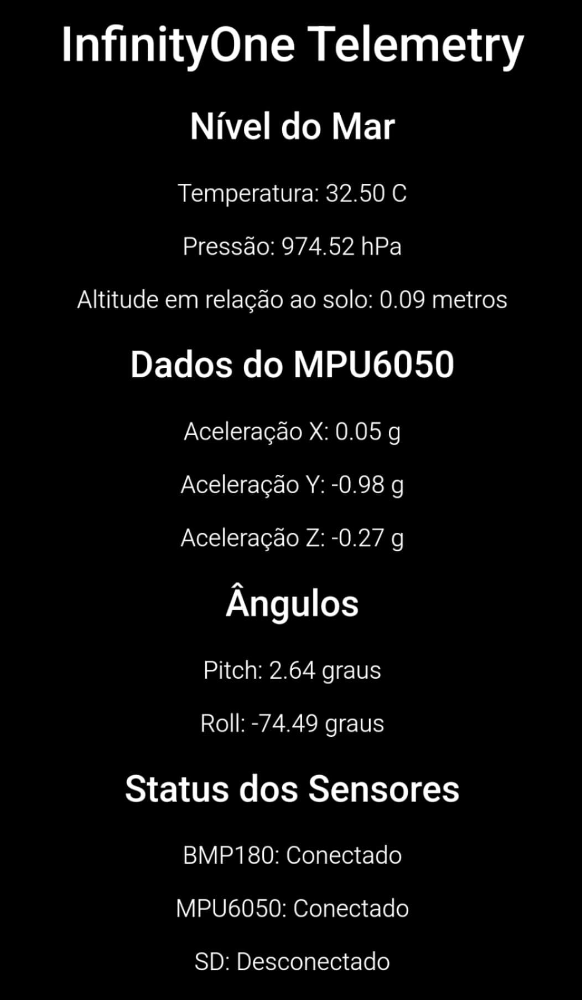
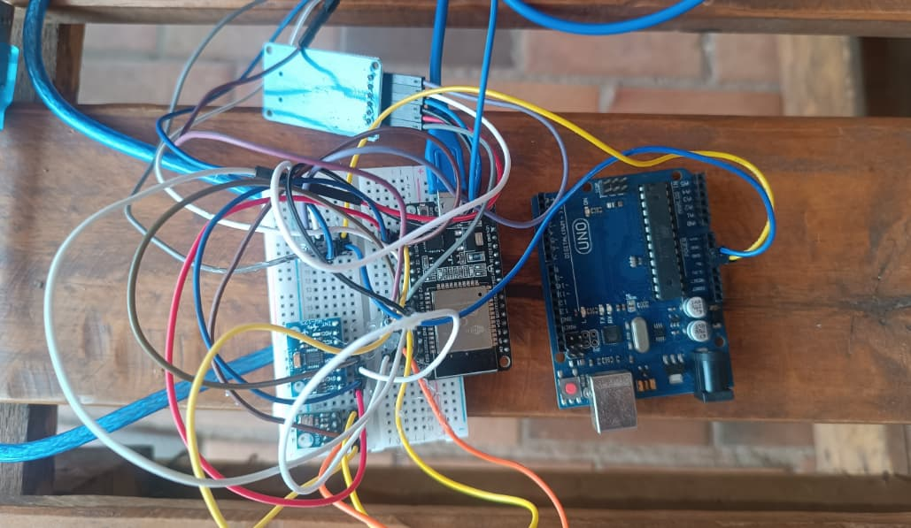

# ESP32 Flight Computer - HTML Telemetry Version

## Overview

This project implements a flight computer using an ESP32 microcontroller. It reads data from various sensors (BMP180 for pressure/temperature/altitude, MPU6050 for acceleration/orientation) and can control a servo motor. The ESP32 hosts a Wi-Fi Access Point and a web server that serves an HTML page displaying real-time telemetry data. This version is primarily for direct browser access and does not output JSON for external applications. It also includes functionality to log data to an SD card.

## Features

* **Sensor Integration:** Reads data from BMP180 (temperature, pressure, altitude) and MPU6050 (accelerometer, gyroscope for pitch/roll).
* **Wi-Fi Access Point:** Creates its own Wi-Fi network for clients to connect.
* **Web Server:** Serves an HTML page with live telemetry data, auto-refreshing every second.
* **Servo Control:** Basic logic to control a servo motor based on pitch or altitude (e.g., for parachute deployment).
* **SD Card Logging:** Logs sensor data to a `datalog.txt` file on an SD card at regular intervals.
* **Sensor Status Display:** Shows the connection status of BMP180, MPU6050, and SD card on the HTML page.

## Hardware Requirements

* ESP32 Development Board
* BMP180 Barometric Pressure Sensor
* MPU6050 Accelerometer/Gyroscope Module
* Micro SD Card Module (with SPI interface)
* Micro SD Card
* Servo Motor (e.g., SG90)
* Connecting Wires
* Power Supply (e.g., USB or battery)

## Software Requirements & Libraries

* Arduino IDE or PlatformIO
* **ESP32 Board Support Package** for Arduino IDE
* Libraries:
    * `WiFi.h`
    * `Wire.h`
    * `Adafruit_Sensor.h`
    * `Adafruit_BMP085.h` (Note: This library is for BMP085/BMP180)
    * `MPU6050.h` (Ensure you have a compatible MPU6050 library, e.g., by Electronic Cats or Adafruit)
    * `SD.h`
    * `ESP32Servo.h`

## Setup Instructions

1.  **Connections:**
    * Connect the BMP180 sensor to the ESP32's I2C pins (SDA, SCL).
    * Connect the MPU6050 sensor to the ESP32's I2C pins (SDA, SCL).
    * Connect the SD Card Module to the ESP32's SPI pins (MOSI, MISO, SCK, CS). Update `SD_CS_PIN` in the code if you use a different CS pin.
    * Connect the Servo Motor's signal pin to the pin defined by `SERVO_PIN`. Provide appropriate power (5V) and ground to the servo.
2.  **Wi-Fi Credentials:**
    * In the `.ino` file, modify the `ssid` and `password` variables to set the name and password for the Wi-Fi Access Point that the ESP32 will create:
        ```cpp
        const char* ssid = "YourRocketAPName";
        const char* password = "YourRocketPassword";
        ```
3.  **Library Installation:**
    * Open the Arduino IDE, go to Sketch > Include Library > Manage Libraries.
    * Search for and install the libraries listed above.
4.  **Board Selection:**
    * In the Arduino IDE, select your ESP32 board model under Tools > Board.
5.  **Upload Code:**
    * Compile and upload the sketch to your ESP32.

## How It Works

1.  **Initialization (`setup()`):**
    * Serial communication is started for debugging.
    * The ESP32 initializes as a Wi-Fi Access Point.
    * Sensors (BMP180, MPU6050), the SD card module, and the servo motor are initialized.
    * Initial altitude is recorded to calculate altitude relative to the ground.
    * The web server is started.
2.  **Main Loop (`loop()`):**
    * Sensor data (temperature, pressure, altitude, acceleration, pitch, roll) is continuously read.
    * Altitude relative to the ground is calculated.
    * Logic for servo deployment based on pitch or altitude is checked.
    * Data is logged to the SD card at a defined `interval`.
    * The ESP32 listens for incoming client connections on the web server.
    * **HTTP Request Handling:** When a client (e.g., a web browser) connects:
        * The ESP32 reads the client's HTTP request.
        * It dynamically generates an HTML page containing the latest sensor readings and status.
        * The HTML page includes a meta refresh tag to automatically reload every second, providing a live view of the data.
        * The HTML response is sent to the client.

## Troubleshooting

* **No AP Visible:** Check serial monitor output for errors during AP setup. Ensure `ssid` and `password` are valid.
* **Sensor Not Found:** Verify I2C wiring (SDA, SCL, VCC, GND). Check if the correct I2C address is being used by the libraries (usually auto-detected).
* **SD Card Initialization Failed:** Check SPI wiring (MOSI, MISO, SCK, CS, VCC, GND). Ensure the SD card is formatted correctly (FAT16 or FAT32). Try a different SD card.
* **No Web Page:** Ensure your device is connected to the ESP32's Wi-Fi AP. Check the IP address printed on the serial monitor and enter it into your browser.
* **Servo Not Moving:** Check servo wiring (Signal, VCC, GND). Ensure `SERVO_PIN` is correct. The servo might require an external power supply if the ESP32's 3.3V/5V pin cannot provide enough current.

## Visuals

<p align="center">
  
  
</p>

<p align="center">
  <em>HTML Telemetry Page &nbsp;&nbsp;&nbsp;&nbsp;&nbsp;|&nbsp;&nbsp;&nbsp;&nbsp;&nbsp; Flight Computer Hardware Setup</em>
</p>
