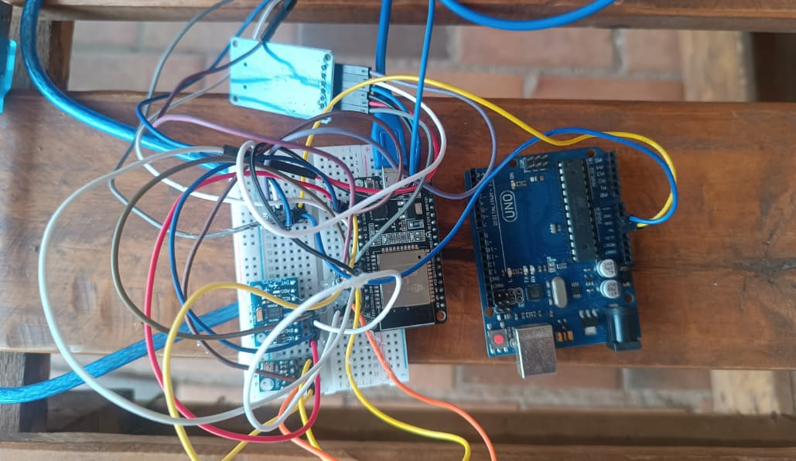

# ESP32 Flight Computer - JSON Telemetry for Flutter App

## Overview

This project configures an ESP32 microcontroller as a flight computer designed to interface with a companion Flutter application. It gathers data from BMP180 (pressure, temperature, altitude) and MPU6050 (acceleration, orientation) sensors, controls a servo motor, and logs data to an SD card. The ESP32 creates a Wi-Fi Access Point and runs a web server that serves real-time telemetry data in JSON format, specifically for consumption by the Flutter app.

## Features

* **Sensor Integration:** Collects data from BMP180 and MPU6050 sensors.
* **Wi-Fi Access Point:** Establishes its own Wi-Fi network.
* **JSON Web Server:** Serves sensor data formatted as a JSON object when a GET request is made to the root path (`/`). This is the primary interface for the Flutter application.
* **Servo Control:** Implements logic for parachute deployment via a servo motor based on flight parameters (pitch or altitude).
* **SD Card Logging:** Periodically saves telemetry data to a `datalog.txt` file on a micro SD card.
* **Real-time Data for App:** Provides a structured JSON output suitable for parsing and display in the Flutter application.

## Hardware Requirements

* ESP32 Development Board
* BMP180 Barometric Pressure Sensor
* MPU6050 Accelerometer/Gyroscope Module
* Micro SD Card Module (SPI interface)
* Micro SD Card
* Servo Motor (e.g., SG90)
* Connecting Wires
* Power Supply

## Software Requirements & Libraries

* Arduino IDE or PlatformIO
* **ESP32 Board Support Package**
* Libraries:
    * `WiFi.h`
    * `Wire.h`
    * `Adafruit_Sensor.h`
    * `Adafruit_BMP085.h` (for BMP085/BMP180)
    * `MPU6050.h` (compatible MPU6050 library)
    * `SD.h`
    * `ESP32Servo.h`

## Setup Instructions

1.  **Hardware Connections:**
    * Connect BMP180 and MPU6050 to ESP32 I2C pins (SDA, SCL).
    * Connect SD Card Module to ESP32 SPI pins (MOSI, MISO, SCK, CS). Update `SD_CS_PIN` if using a different CS pin.
    * Connect Servo Motor signal to `SERVO_PIN`. Ensure proper power and ground for the servo.
2.  **Wi-Fi Configuration:**
    * In the `.ino` sketch, set the `ssid` and `password` for the Wi-Fi Access Point:
        ```cpp
        const char* ssid = "InfinityOne";
        const char* password = "12345678";  
        ```
3.  **Library Installation:**
    * Using the Arduino IDE Library Manager, install the libraries listed above.
4.  **Board Selection:**
    * Select your ESP32 board type in Tools > Board.
5.  **Upload Sketch:**
    * Compile and upload the provided `.ino` sketch to the ESP32.


### Flutter App:
**With this app you can connect to the rocket flight controller via wifi**
**https://github.com/Heitorkk2/Ispace-receiver**

## How It Works

1.  **Initialization (`setup()`):**
    * Starts serial communication for debugging.
    * Configures the ESP32 as a Wi-Fi Access Point. The IP address (usually `192.168.4.1`) will be printed to the serial monitor.
    * Initializes all connected sensors (BMP180, MPU6050), the SD card, and the servo.
    * Records the initial altitude for calculating relative altitude.
    * Starts the web server.
2.  **Main Loop (`loop()`):**
    * Continuously reads and processes data from the sensors.
    * Calculates altitude relative to the ground, pitch, and roll.
    * Updates the `currentSystemOutput` string based on parachute deployment logic.
    * Logs data to the SD card at specified intervals.
    * Listens for incoming HTTP client connections.
    * **JSON Request Handling:** When the Flutter app (or any HTTP client) sends a `GET /` request:
        * The ESP32 gathers the latest sensor readings.
        * It constructs a JSON string containing all relevant telemetry data (e.g., `BMPStatus`, `MPU_X`, `BMP_Altitude`, `Output`).
        * It sends an HTTP response with `Content-Type: application/json` and the JSON data as the body.
        * The connection is then closed.


## Troubleshooting

* **Flutter App Can't Connect:**
    * Ensure the mobile device is connected to the ESP32's Wi-Fi AP ("InfinityOne" or your custom SSID).
    * Verify the IP address used in the Flutter app matches the ESP32's AP IP (usually `192.168.4.1`).
    * Check the serial monitor for any errors from the ESP32.
* **Incorrect JSON Data:**
    * Use a tool like Postman or a web browser to directly access `http://<ESP32_IP>/` and inspect the raw JSON output.
    * Ensure all sensor readings are valid and the JSON structure matches what the Flutter app's `TelemetryData.fromJson` expects.
* **Sensor "offline" in JSON:** Double-check sensor wiring and I2C/SPI connections. See serial monitor for sensor initialization errors.
* **SD Card Issues:** Confirm SD card is formatted (FAT16/FAT32) and correctly wired.

## Visuals

<p align="center">
  
  
</p>

<p align="center">
  <em>Infinity One Flutter App &nbsp;&nbsp;&nbsp;&nbsp;&nbsp;|&nbsp;&nbsp;&nbsp;&nbsp;&nbsp; Flight Computer Hardware Setup</em>
</p>

