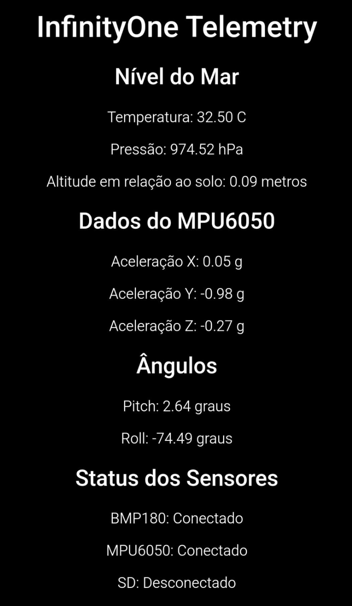
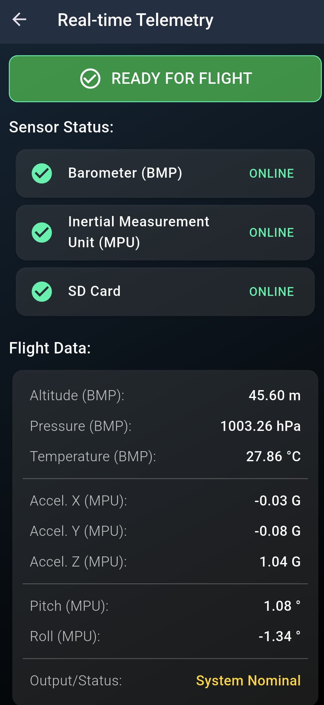
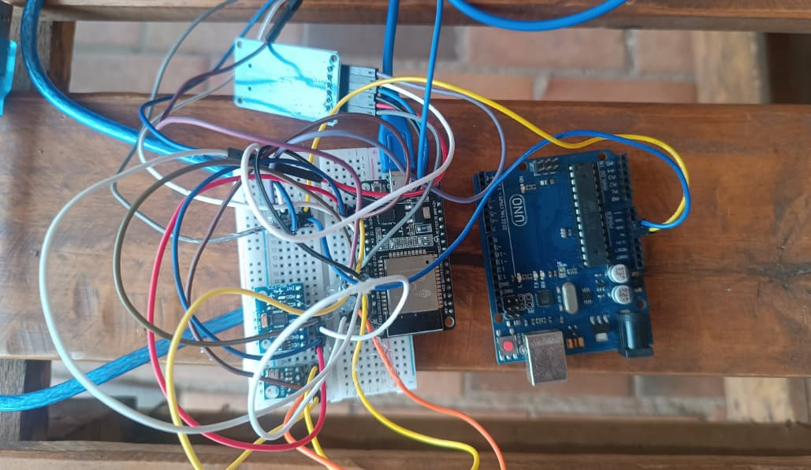
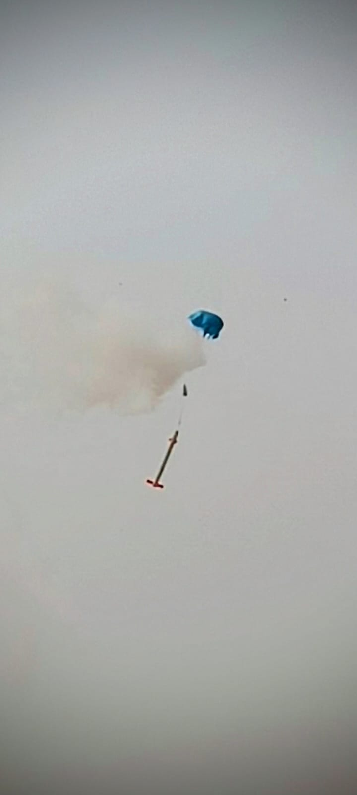

  

    <h1>🚀 Ispace Flight Computer Project</h1>
    
<strong>Welcome to the Ispace Flight Computer project!</strong> 
    This repository contains the development of a modular and evolving <strong>ESP32-based flight computer system</strong>, tracking progress from a simple HTML telemetry server to a fully integrated mobile telemetry platform.

  

---

## 🧠 Overview
The goal of this project is to develop a robust and flexible flight computer capable of:

- 📡 Collecting live telemetry data  
- 🎮 Controlling actuators (like parachute servos)  
- 📲 Providing real-time feedback via modern interfaces

The system has evolved through two main versions:

---

## 🕸️ Version 1: HTML Telemetry (Legacy)

  

In **Version 1**, the ESP32 creates a local Wi-Fi Access Point and hosts a basic HTML page displaying live sensor data.

- **Functionality:** Embedded web server on ESP32  
- **Data Format:** HTML  
- **Code Location:** `./V1/`

🔍 For more details, check the README inside the `V1` folder.

---

## 📱 Version 2: JSON + Flutter App (Current)

  

**Version 2** brings a major upgrade — pairing the ESP32 with a modern **Flutter mobile app** that consumes telemetry in **JSON** format.

- **Functionality:**  
  ESP32 serves telemetry as JSON at `/` endpoint via HTTP over a self-hosted Wi-Fi network.
- **Data Format:** JSON  
- **Flutter App Repository:**  
  [🌐 github.com/Heitorkk2/Ispace-receiver](https://github.com/Heitorkk2/Ispace-receiver)
- **Code Location:** `./V2/`  

---

## 🛠️ Hardware Overview

  

The flight computer is built around the **ESP32**, supported by essential modules for data acquisition and logging:

- **MPU6050** – 6-axis gyroscope and accelerometer  
- **BMP180** – Barometric pressure and temperature sensor  
- **MicroSD Module** – For logging telemetry and events  
- **Servo** – For parachute deployment (in relevant versions)

---

## ✨ Project Visuals

  
  

  <em>Launch & Glory – The Ispace Rocket on a mission</em>

---

## 🤝 Contribution
💖 Feel free to fork, improve, or suggest features.  
Each version contains its own README and architecture notes — please refer to them for specific guidance.

---

  Made with ❤️ and esp32 by <strong>Heitorkk2</strong> (⁠◍⁠•⁠ᴗ⁠•⁠◍⁠)✧⁠*⁠。🚀 

